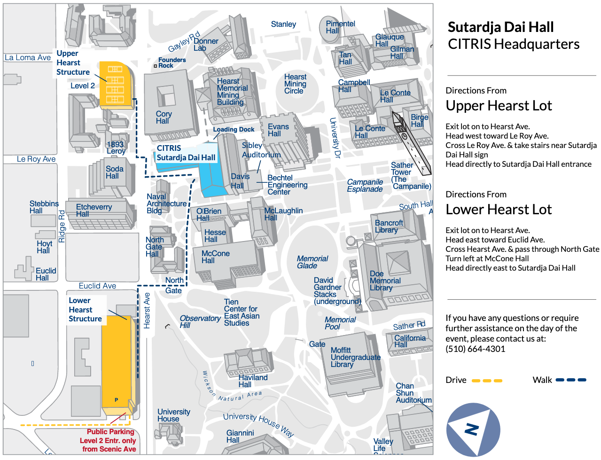

## Materials Project Workshop 2019

* [Schedule](#schedule)
* [Getting Here](#getting-here)

### Tentative Schedule

All activities are in [310 Sutardja Dai Hall](#getting-here).
Breakfast arrives on Wednesday, Thursday and Friday mornings at 08:30.

(optional) Wed morning -- Python/Jupyter primer
* 09:00-09:15 Intro - Variables and Arithmetic
* 09:15-10:30 Built-ins - Lists, Functions, Packages, Dictionaries
* 10:30-10:45 coffee break
* 10:45-12:00 Control: Logic, Loops, Creating Functions, Iterators
* 12:00-13:00 lunch

(optional) Wed afternoon -- MongoDB using Python primer 
* 13:00-13:15 Data Modeling - Python Types to JSON to MongoDB
* 13:15-14:30 Listing, Counting, Finding, and Dot Notation
* 14:30-14:45 coffee+stretch break
* 14:45-16:00 Advanced Filtering, Basic Aggregation, and Sorting
* 16:00-16:30 wrap-up

Thu morning
* 09:00-09:15 Overview of MP data+software ecosystem
* 09:15-10:30 Website and Basic API use
* 10:30-10:45 Coffee+stretch break
* 10:45-12:00 Pymatgen core - foundations and useful functionality
* 12:00-13:00 Lunch

Thu afternoon
* 13:00-13:15 Catch-up
* 13:15-14:30 Pymatgen adventures - several case studies, including use of MP API
* 14:30-14:45 Coffee+stretch break
* 14:45-16:00 Advanced API use - materials informatics
* 16:00-16:30 Wrap-up

Fri morning
* 09:00-09:15 Overview of MP workflow infrastructure
* 09:15-10:30 Atomate basics - Building a workflow
* 10:30-10:45 Coffee+stretch break
* 10:45-12:00 Atomate intermediate - Managing complex workflows
* 12:00-13:00 Lunch

Fri afternoon
* 13:00-13:15 catch-up
* 13:15-14:30 [MPContribs](https://mpcontribs.org): Your data on MP
* 14:30-14:45 Coffee+stretch break
* 14:45-16:00 Materials data science: descriptors and machine learning
* 16:00-16:30 Wrap-up

### Getting here
The workshop is located in 310 Sutardja Dai Hall, aka the Banatao Auditorium, on the UC Berkeley campus.
[Click here](https://citris-uc.org/visitor-information/) for detailed visitor information, including parking and
transportation options.

The walk from downtown is a bit steep, so you may wish to board a campus shuttle.
