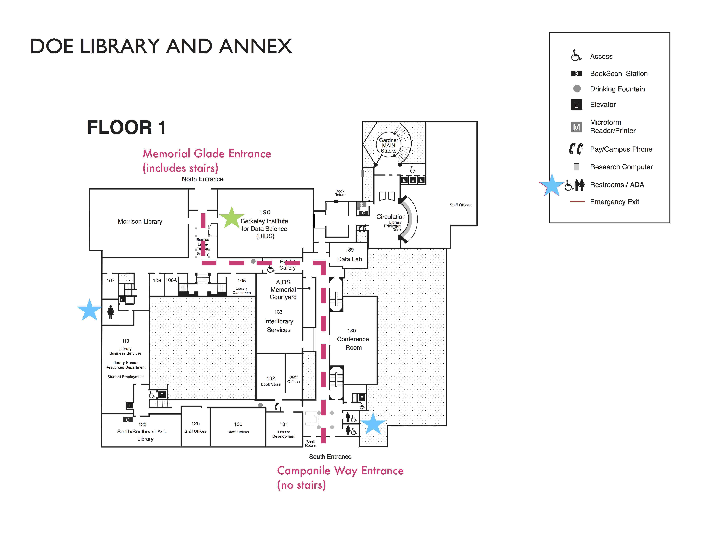
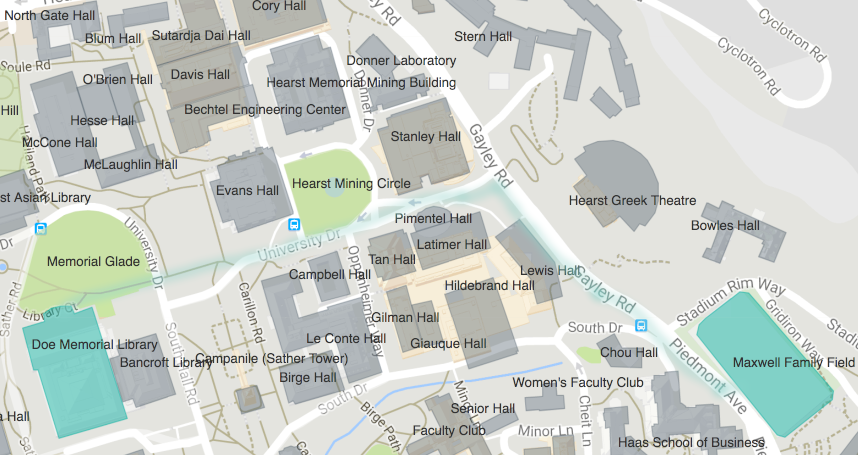
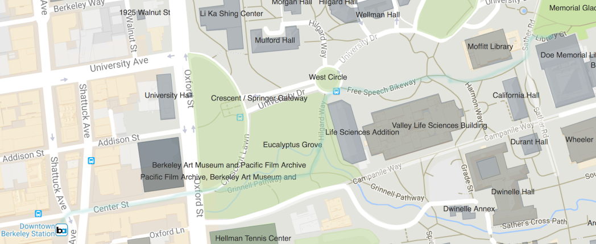

## Materials Project Workshop 2018

* [Before the workshop](#before-the-workshop)
* [Schedule](#schedule)
* [Getting Here](#getting-here)

### Before the Workshop

Please review our [website walkthrough](https://www.youtube.com/watch?v=Mg9AgpwoArQ) video (approx. 40 minutes) so that you understand basic techniques for searching and layout of information. This way, we can avoid such a walkthrough during the workshop and spend more time on interactive instruction and exercises.

### Schedule

Breakfast arrives on Thursday and Friday mornings at 09:00.

Wed afternoon -- Python/Jupyter primer (optional)
* 13:00-13:30 Jupyter basics; Python variables and arithmetic
* 13:30-13:45 Built-in functions and libraries; getting help
* 13:45-14:30 Control flow: conditionals, for loops
* 14:30-15:00 (break)
* 15:00-15:45 Data structures: lists and dictionaries
* 15:45-16:30 Data collection: comprehensions, writing functions

Thu morning
* 09:30-09:45 Intro
* 09:45-11:00 Web site - example usage
* 11:00-11:15 coffee break
* 11:15-12:30 Pymatgen core use – going over useful functionality
* 12:30-13:30 lunch

Thu afternoon
* 13:30-13:45 catch-up/debugging
* 13:45-15:00 Pymatgen adventures - several case studies, including use of MP API
* 15:00-15:15 coffee
* 15:15-16:30 API basics - Designing materials using MP queries

Fri morning
* 09:30-09:45 catch-up/debugging
* 09:45-11:00 Atomate session 1 - Building basic workflows
* 11:00-11:15 coffee break
* 11:15-12:30 Atomate session 2 - Managing complex workflows
* 12:30-13:30 lunch

Fri afternoon (Breakout sessions)
* 13:30-14:45 TBA based on participant polling: Breakout sessions
* 14:45-15:00 coffee break
* 15:00-16:15 TBA based on participant polling: Breakout sessions
* 1: Contributing data to MP
* 2: Analysis of high-throughput workflow results using mongo and maggma
* 3: Materials data science using matminer and scikit-learn
* 4: Milestones in materials design - a walkthrough of past MP discoveries

### Getting here
The workshop is located in 190 Doe Library on the UC Berkeley campus. Doe Library is the central library, adjacent to the beautiful Memorial Glade.

The most convienient parking garage nearby is the [Stadium Parking Garage](https://lots.impark.com/imp#details=37,386) (also known as Maxwell Garage) on the east (uphill) edge of campus at 2175 Gayley Road, with a daily (up to 10 hrs) rate of $15. A walking route from the garage to 190 Doe Library is shown below. 

From the Downtown Berkeley BART station, there is a lovely walk through the Eucalyptus Grove on the west end of campus and past the iconic Valley Life Sciences Building up to the Memorial Glade and Doe Library.

