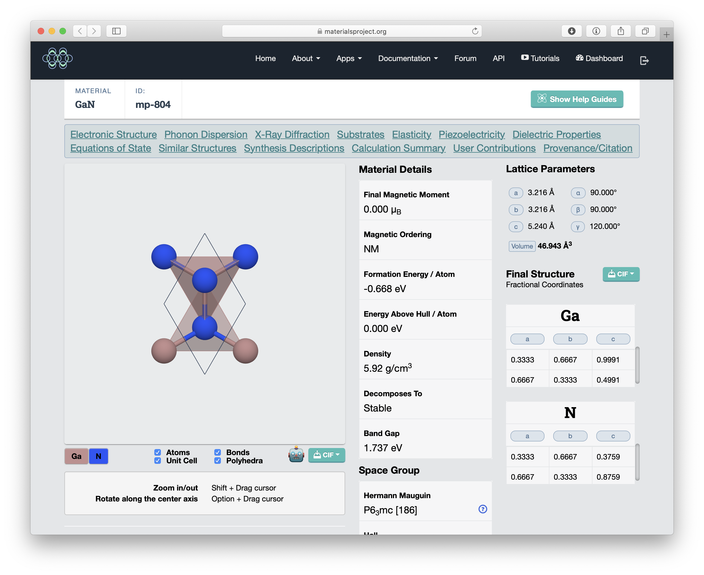

# Using the Materials Project Website

## Purpose of this Session

This session is designed as an introduction make sure that everyone is familiar with the data and analysis that the Materials Project offers and how to access that data.

We will navigate the Materials Project website, explore the properties of a material, and see how aggregations of properties of multiple materials and provide insight.

We will re-visit much of this data and methods later but from a programmatic perspective later within the CoCalc teaching environment.

Slides from this session are also [available](https://github.com/materialsproject/workshop/blob/master/workshop/lessons/01_website_walkthrough/Website%20Walkthrough%20Slides.pdf).

## Where Does Materials Project Data Come From?

The Materials Project offers a variety of properties of hundreds of thousands of inorganic crystalline materials. These properties can be searched, combined and filtered in a variety of ways to help understand existing materials or discover new ones for a variety of modern applications, such as better batteries, optoelectronics, photovoltaics, carbon dioxide reduction and more. But where does this data come from?

Almost all Materials Project data is calculated using a theoretical technique called **Density Functional Theory** (DFT). Teaching the fundamentals of DFT are beyond the scope of this workshop, but if you come from an experimental background there are some important high-level things you should know:

* DFT is an atomistic method. This means it needs approximate positions of atoms and approximate lattice parameters to perform a calculation.

* DFT is a first-principles method. This means that it uses a minimum of empirical information, so it can handle unusual systems well, including materials that have never been synthesized! It scales well to several hundred atoms, but beyond that other methods need to be used.

* However, DFT does still need some form of correction. The particular type of DFT used in Materials Project (GGA/PBE) systematically under-binds materials, meaning that bond lengths (and hence lattice parameters) are systematically larger than expected by 1-2%. This also results in a systematic error in our formation energies, but we can fix this systematic error by fitting our calculated data to experimental formation enthalpies.

* DFT is a ground-state, 0 K method. It can calculate ground state properties well such as bulk modulus, along with electronic structure information (the shape of your band structures, for example) but it is notably bad at calculating excited states including band gaps, and systematically under-estimates band gaps by a large margin. For this reason, any screening based on band gap has to include a large safety margin of ~0.5 eV.

* Our methods are continuously being updated. If you're a DFT person, you're welcome to talk to us about this!

More information on our methods can be found in the [Materials Project Documentation](https://docs.materialsproject.org) and references therein, or you can ask us during this workshop.

### Structure of the Materials Project Database

DFT used to be a prohibitively expensive computational method but now is feasible at scale. Materials Project uses supercomputing resources at the National Energy Research Scientific Computing Center (NERSC) and elsewhere to run millions of DFT calculations using the [VASP](https://vasp.at) DFT code.

To do this, we've developed a suite of open-source scientific codes:

* [pymatgen](https://pymatgen.org), our crystallographic analysis code
* [fireworks](https://materialsproject.github.io/fireworks/), a workflow package to submit, monitor and track supercomputing jobs
* [custodian](https://materialsproject.github.io/custodian/), automated error correction, to fix errors in VASP and other codes without user intervention.
* [atomate](https://atomate.org), 'recipes' for materials science calculations built on top of fireworks
* [maggma and emmet](https://materialsproject.github.io/maggma/), for managing large databases of existing calculations
* [matminer](https://hackingmaterials.lbl.gov/matminer/), to data mine our databases for machine learning

We will explore the use of some of these codes in this workshop. All codes have publications, documentation and source code freely available.

When performing calculations for the Materials Project, every distinct DFT calculation task we perform gets assigned an identifier, a materials ID or **mp-id**.

Eery single property for a given material might need one or more distinct calculation tasks to calculate it, so this means that every single material has *multiple* mp-ids associated with it: one for each task. For example, we have the mp-id for the task used to calculate the lattice parameters and atomic positions, the task to calculate the energy, the task to calculate its band structure, etc.

We then group together all the calculations for a given material together and use a single mp-id, typically the oldest one, to use for its canonical database identifier and URL on materialsproject.org, however it should be noted that any mp-id from any calculation associated with a given material can be used to find that calculation.

Our implicit "user contract" is that the information on a specific calculation task will always remain available and unchanged via our website or API. For example, the final energy from a given calculation task will always remain the same and remain accessible. However our *derived data*, such as the summarized information on the materials detail page like formation energy, may change with from one database release to the next as we perform newer, better calculations that might supercede our old data. Therefore, if you want to cite Materials Project data, make sure to include the database version information with your citation.

## 1. Searching the Materials Project

This part of the walkthrough will be in the [Materials Explorer](https://materialsproject.org/#search/materials/) search app.

We will briefly demonstrate how to identify experimentally synthesized structures, how to interpret the "energy above hull" and why this is important, and introduce an advanced search syntax we will use later in our API lesson.

## 2. Understanding a "Materials Details" Page

This part of the walkthrough will take you through a typical "Materials Details" page, such as [this one for GaN](https://materialsproject.org/materials/mp-804/) and [this one for Fe](https://materialsproject.org/materials/mp-13/), and look at various properties including:

* Electronic Structure
* Phonon Dispersion
* X-Ray Diffraction
* Substrates
* Surfaces
* Grain Boundaries
* Elasticity
* Piezoelectricity
* Dielectric Properties
* Equations of State
* Similar Structures
* Synthesis Descriptions
* Calculation Summary
* User Contributions (see later session)
* Provenance/Citation

We will talk about the subtlety of crystallographic setting in interpreting lattice parameter, how to download a CIF file for the relevant crystal structure, examine references for the crystal structure from the literature (where applicable), discuss why not all materials have all properties, and show advanced users where to find details on calculation parameters.

## 3. Using Materials Project Apps

This part of the walkthrough will show the variety of "apps" available on Materials Project. These apps combine the information we have about multiple materials to build phase diagrams, aqueous stability (Pourbaix) diagrams and more.

# Getting Help

After the workshop, make sure to visit [our discussion forum at matsci.org](https://matsci.org/materials-project) with any questions, and we will be happy to help!
